# Steps to Install and Enable Backup Compatibility of Bold BI on AWS EC2 Windows instance

| SEO Details       |                                                                     |
|-------------------|---------------------------------------------------------------------|
| Meta Title        | Installing and Enabling Backup Compatibility for Bold BI on  AWS EC2 Windows instance |
| Meta Description  | Learn how to install Bold BI on AWS EC2 Windows instance and enable backup compatibility with easy-to-follow steps. Ensure data protection and disaster recovery for your Bold BI installation. |

## Below are the steps that will help you to install Bold BI.

### 1. Launch an EC2 Windows instance on AWS
   - To create an EC2 Windows instance in AWS, refer to this [link](https://docs.aws.amazon.com/AWSEC2/latest/WindowsGuide/EC2_GetStarted.html).

### 2. Setup RDS (Relational Database Service) for PostgreSQL
If you want to set up a PostgreSQL Database on EC2 Windows instance, follow the step `a`. If you prefer using a managed RDS in AWS, follow the step `b`.

#### a. Setting up PostgreSQL in a EC2 Windows instance
- Download the [PostgreSQL installer for Windows](https://www.enterprisedb.com/downloads/postgres-postgresql-downloads) and install it.
- For detailed installation steps, refer to this [guide](https://www.postgresqltutorial.com/postgresql-getting-started/install-postgresql/).

**Information:**
  - For installing a MySQL database in a Windows EC2 instance, refer to the steps outlined in this [guide](https://dev.mysql.com/doc/refman/8.3/en/windows-installation.html).
  - To install an MS SQL database in Windows EC2 instance, follow the instructions provided in this [guide](https://learn.microsoft.com/en-us/sql/database-engine/install-windows/install-sql-server?view=sql-server-ver16).

#### b. Setting up PostgreSQL RDS in AWS
- To create an PostgreSQL RDS in AWS, refer to this [link](https://aws.amazon.com/getting-started/hands-on/create-connect-postgresql-db/).

**Information:** 
  - To create a MySQL RDS in AWS, follow the instructions in this [link](https://aws.amazon.com/getting-started/hands-on/create-mysql-db/).
  - To create a MS SQL RDS in AWS, follow the instructions in this [link](https://aws.amazon.com/getting-started/hands-on/create-microsoft-sql-db/).

### 3. Bold BI Installation
   - Enable necessary features in IIS to run Bold BI on Windows Server OS. Refer to this [link](https://help.boldbi.com/faq/features-needed-to-enable-in-iis-to-run-bold-bi-in-win-server-os/).
   - Download different versions of Bold BI from [here](https://www.boldbi.com/account/downloads) and proceed with installation.
   - Follow the installation steps in the Bold BI documentation [here](https://help.boldbi.com/deploying-bold-bi/deploying-in-windows/installation-and-deployment/).
   - For guidance on startup configuration for Bold BI, refer to this [link](https://help.boldbi.com/application-startup/latest/).

### 4. DNS Mapping and Binding with Bold BI Application (Optional)

- Map IP Address to Domain Name
  - Log in to your domain registrar's website.
  - Navigate to the DNS management section.
  - Create an A record that points your domain name to the IP address of your VM.

- Bind the Domain with Bold BI
    - Open IIS Manager and select `Server Certificates` below the server node.
    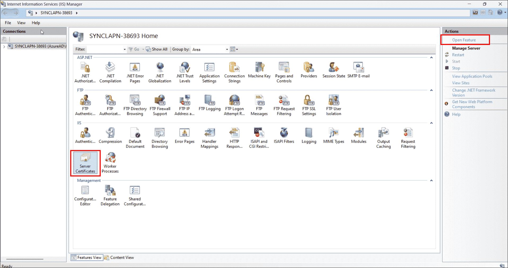
    - Click on` Open Feature` to import the SSL certificate. Upload the certificate, enter the password, select the certificate store type, and click `OK`.
    
    - Navigate to your `BoldBIEnterpriseEdition `folder in IIS, then click on `Bindings`. Click `Add` and select type as` https`. Upload the SSL certificate and click `OK`.
    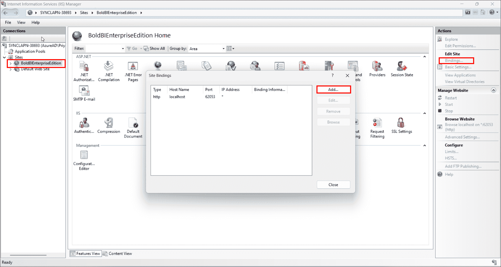
    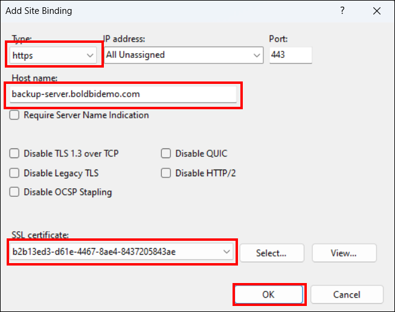

    - In the Bold BI Enterprise Edition, go to the right pane. Below the browse website, you can find the domain name you bound. Now you can access the Bold BI application through the domain name.

## To Enable Backup compatibility of Bold BI application

### 1. Create a snapshot of an EC2 Windows instance
- Go to your EC2 instance and select the `Storage` tab, then the EC2 instance Volume.
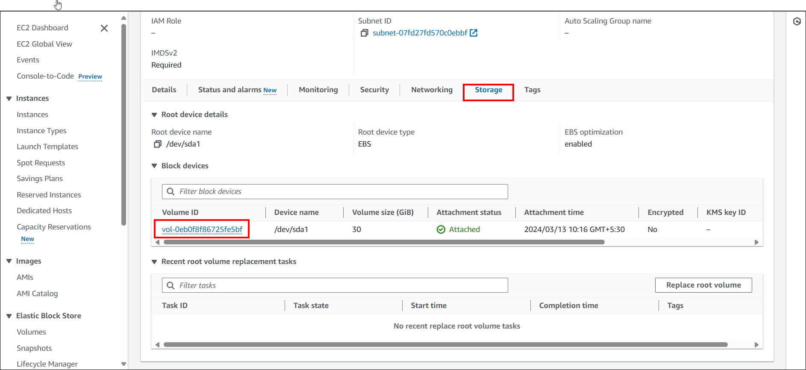
- Choose your EC2 instance volume, and in the upper right corner, click `Action` and select the `Create Snapshot` button.
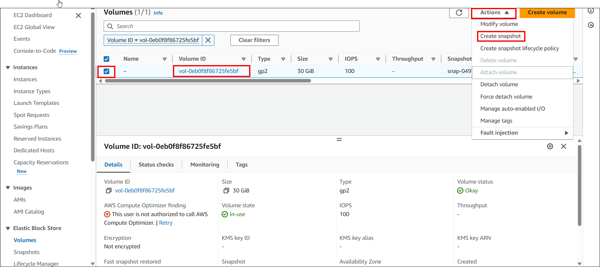
- A new window will appear. Enter the Snapshot name and click `Create snapshot`.
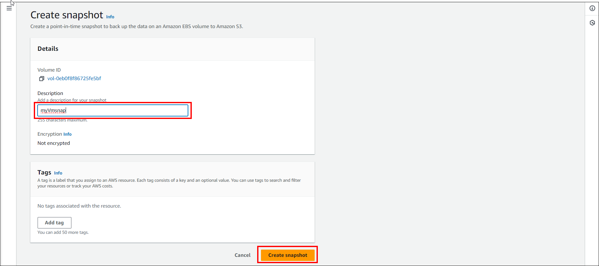
- Once the snapshot is created, it will appear in the list of snapshots in the Amazon EC2 console.
- For complete instructions to make a snapshot of an EC2 Windows instance, follow this [guide](https://docs.aws.amazon.com/ebs/latest/userguide/ebs-creating-snapshot.html).

To restore a virtual machine (EC2 instance) from a snapshot in AWS, you will need to create an Amazon Machine Image (AMI) from the snapshot and then use the AMI to launch a new EC2 instance. Here are the steps to create an AMI from a snapshot:
- In the navigation pane, under "ELASTIC BLOCK STORE", select `Snapshots` then select your Snapshot that you created in above step then click on the `Action `button on the above right and click on `Create image from snapshot`.
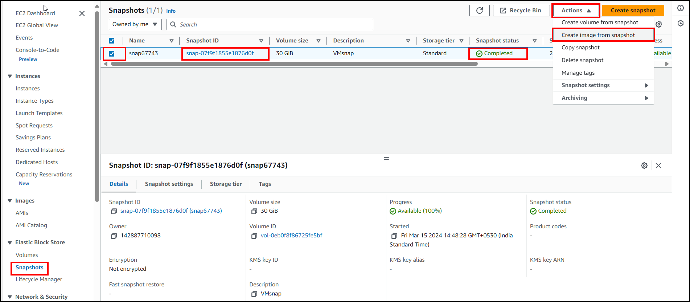
- Enter a name for the AMI in the "Image name" field.Optionally, enter a description for the AMI in the "Image description" field.Choose an architecture for the AMI (e.g., 64-bit or 32-bit).
Select the instance type for the AMI (e.g., t2.micro, m5.large, etc.).Configure other instance details as needed.
- Review the AMI configuration and click on the `Create image` button to create the AMI.
- Once the AMI is created, it will appear in the list of AMIs in the Amazon EC2 console.
- For complete instructions to create an AMI image from the snapshot, refer to this [link](https://docs.aws.amazon.com/AWSEC2/latest/WindowsGuide/Creating_EBSbacked_WinAMI.html).

### 2. Restore the EC2 instance from AMI
- In the navigation pane, under `Images`, select `AMIs`.Select the AMI you want to use to restore your EC2 instance. Right-click on the selected AMI and choose `Launch Instance` from the context menu.
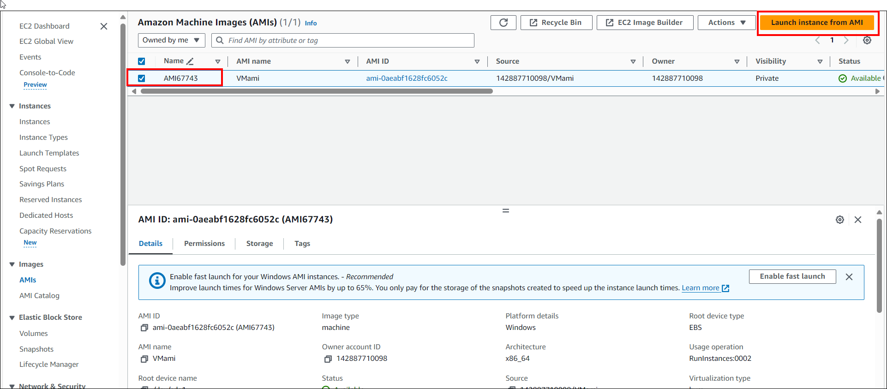
- Follow the instance launch wizard to configure your new EC2 instance.Enter the instance name, Select the instance type, configure networking, and add storage as needed. Review the instance details and click on the `Launch` button.If required, select an existing key pair or create a new one to access your instance securely.
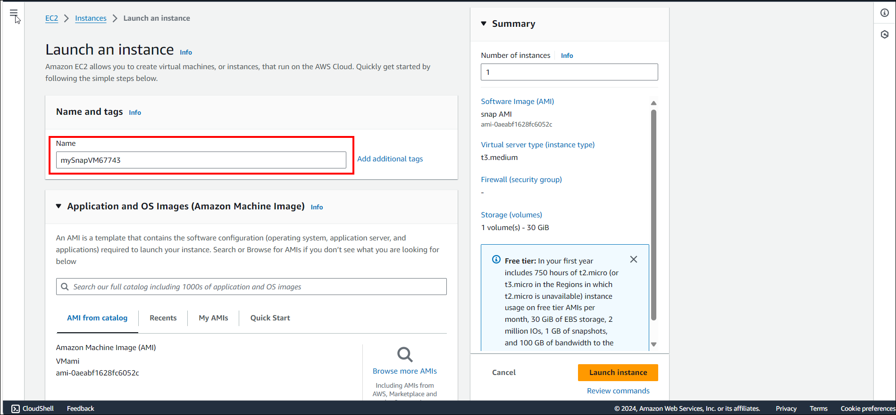
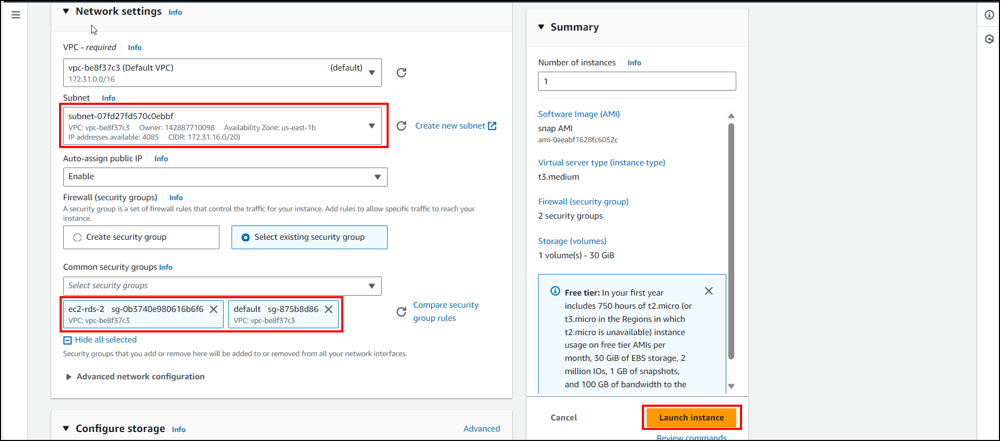
- Once the instance is launched, you can access it using the specified key pair and any necessary credentials.

### 3. Create a snapshot of an RDS instance
- In the navigation pane, choose `Databases`.
Select the RDS instance for which you want to create a snapshot.
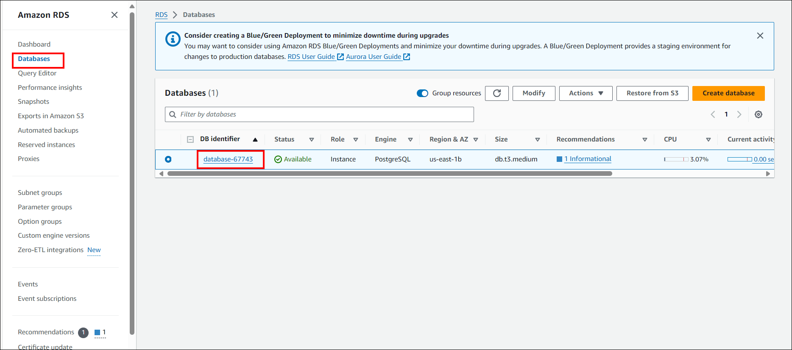
- In the `Instance actions`dropdown menu, choose `Take snapshot`.
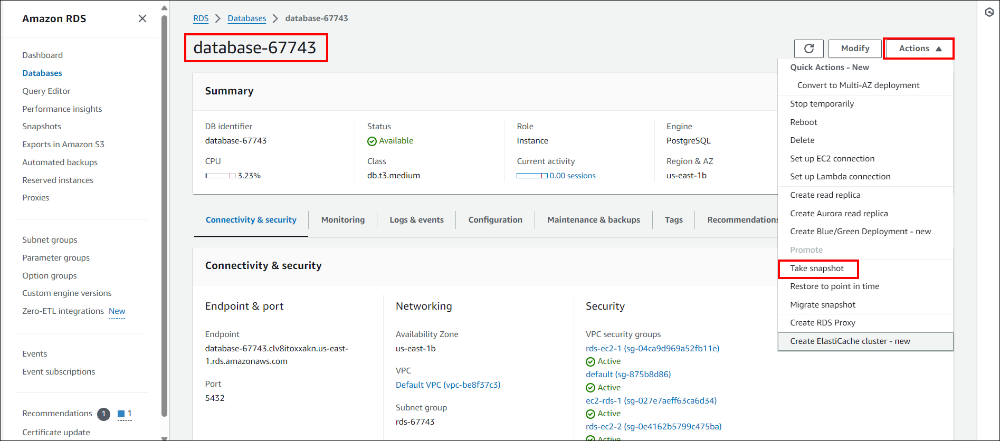
- Enter a name for the snapshot in the "Snapshot name" field.Optionally, enter a description for the snapshot in the "Description" field.Click on the `Take snapshot`button to create the snapshot.
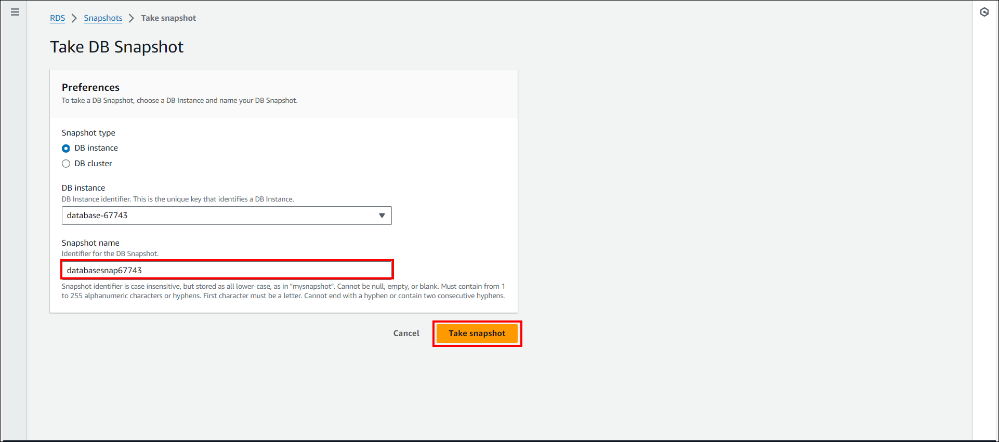
- For complete instructions to Create a snapshot of an RDS instance refer to this [link](https://docs.aws.amazon.com/AmazonRDS/latest/UserGuide/USER_CreateSnapshot.html)

### 4. Restore the RDS from Snapshot
- Go to the Amazon RDS console. In the navigation pane, choose `Snapshots`. Select the snapshot you want to restore from.
- Click on the `Actions` dropdown menu and select `Restore snapshot`.
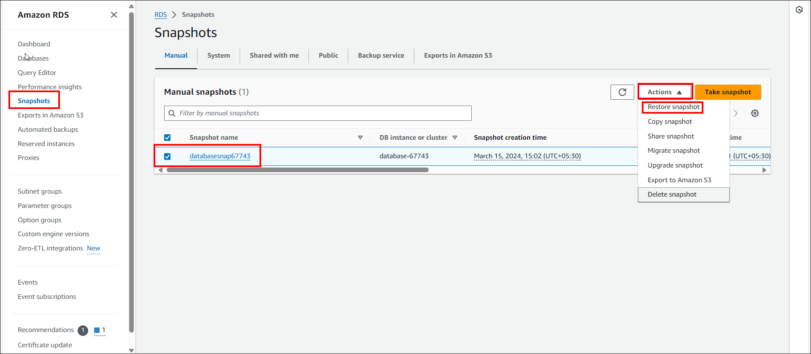
- Enter a new DB instance identifier for the restored instance.Choose the DB instance class for the new instance.Configure other settings such as storage, network, and database options as needed.
- Click on the `Restore DB instance` button to start the restoration process.
- Once the restoration is complete, verify that the new RDS instance is available and functioning as expected.

## 6. Reset the connection string to use the restored PostgreSQL database and establish access to the application.

- To use the restored database, you'll need to reset the database on your Virtual Machine.
Detailed steps can be found in the following documentation: [Reset Application Database on Windows](https://help.boldbi.com/utilities/bold-bi-command-line-tools/reset-application-database/#windows)

- If your original VM was configured using DNS mapping, after restoring your snapshot VM, map the snapshot VM's IP address to the previously created domain. Once the mapping is complete and the database is reset, stop or delete the original VM and database. Finally, access the application in the browser using the domain name. 
